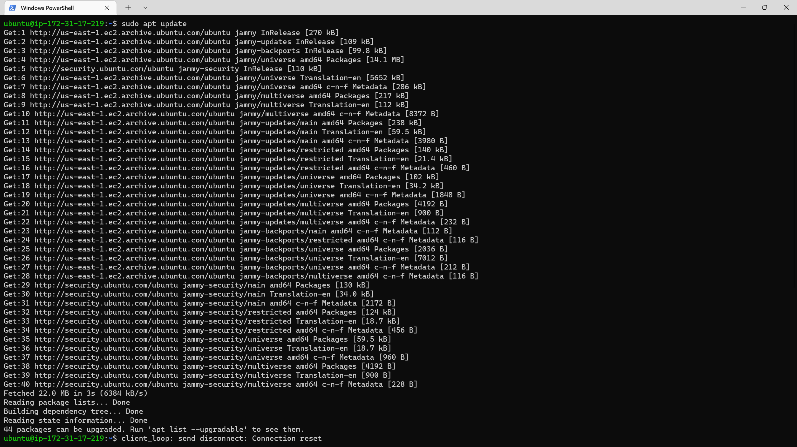

# SIMPLE TO-DO APPLICATION ON MERN WEB STACK

In this project we would be implementing a simple to-do application on MERN stack on an AWS EC2 instance. And we would be performing the following functions:
- backend configuration
- Install expressjs
- Models
- Mongodb database
- frontend creation
- Frontend creation (continued)

## Backend Configuration
Here we would begin by configuring the backend for our to-do app.

- update ubuntu on the instance.
    ```
    sudo apt update
    ```

    Results:
    
