# SIMPLE TO-DO APPLICATION ON MERN WEB STACK

In this project we would be implementing a simple to-do application on MERN stack on an AWS EC2 instance. And we would be performing the following functions:
- backend configuration
- Install expressjs
- Models
- Mongodb database
- frontend creation
- Frontend creation (continued)

## Backend Configuration
Here we would begin by configuring the backend for our to-do app.

- update ubuntu on the instance.
    ```
    sudo apt update
    ```

    Results:
    

- upgrade ubuntu on the instance
    ```
    sudo apt upgrade
    ```

    Results:
    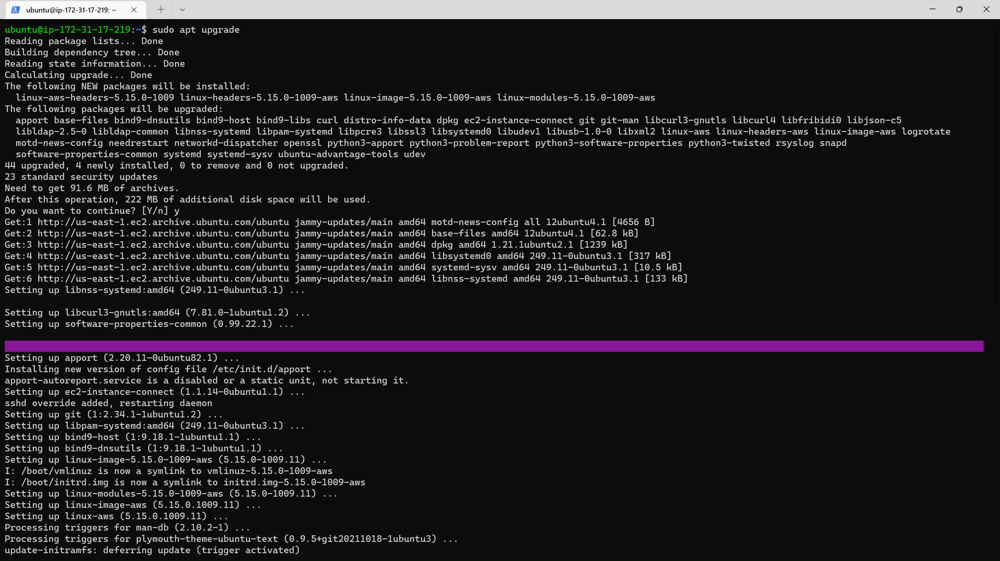

- Get the location of Node.js software from Ubuntu repositories.
    ```
    curl -fsSL https://deb.nodesource.com/setup_18.x | sudo -E bash -
    ```

    Results:
    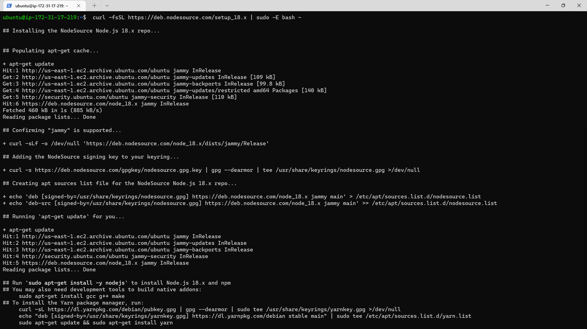

- Installing Node.js on the server
    ```
    sudo apt install nodejs
    ```

    Results:
    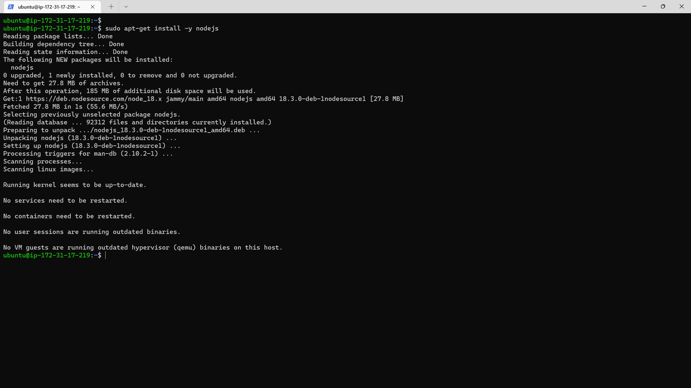

    Note: The command above installs both nodejs and npm. NPM is a package manager for Node like apt for Ubuntu, it is used to install Node modules & packages and to manage dependency conflicts.

- verify node installation
    ```
    node -v
    ```

    Results:
    

    Note: The command above verifies that nodejs is installed on the server.

- verify npm installation
    ```
    npm -v
    ```

    Results:
    

    Note: The command above verifies that npm is installed on the server.

- Application Code Setup
    We would need to create a new directory for our To-Do project:

    ```
    mkdir Todo
    ```

    Results:
    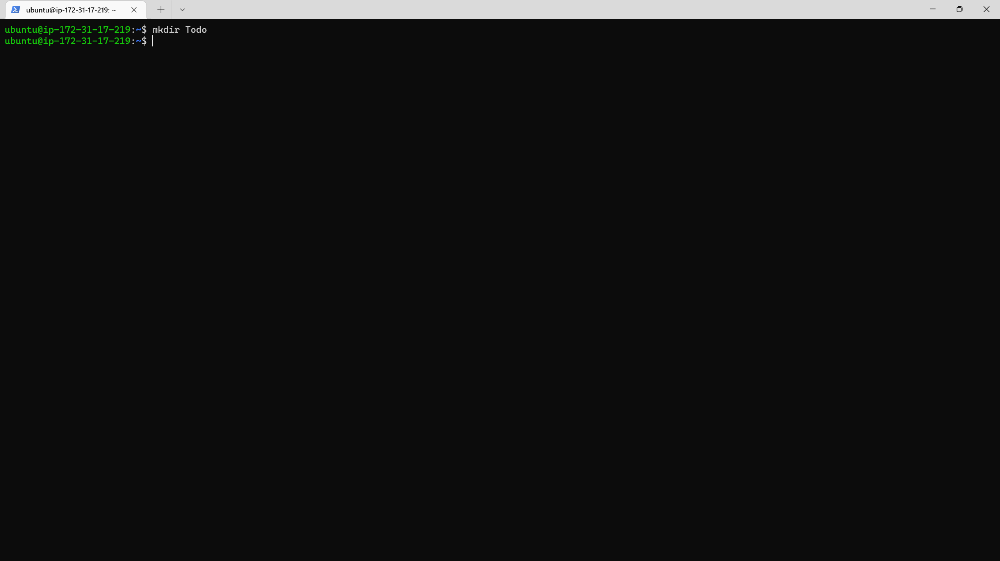

- Run the command below to verify that the Todo directory is created with ls command
    ```
    ls
    ```

    Results:
    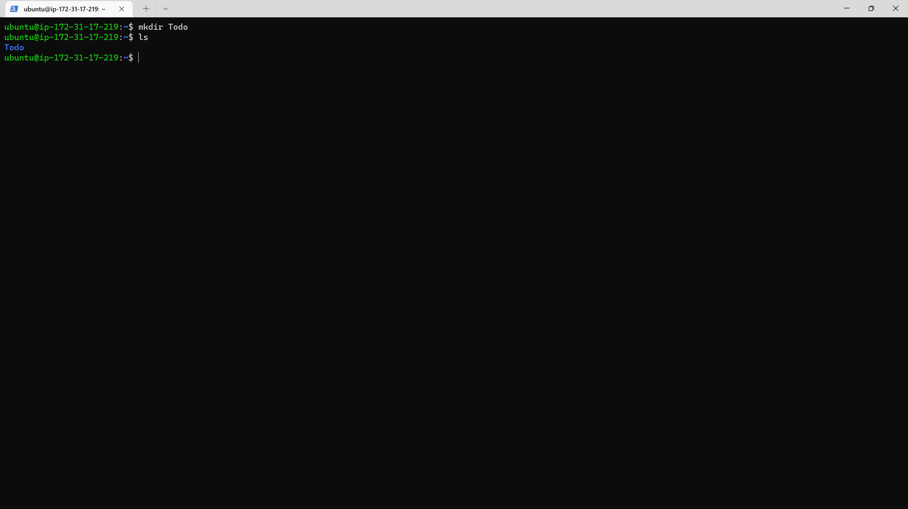

    Note: The command above verifies that the Todo directory is created with ls command.

- Now we change our current directory to the newly created one
    ```
    cd Todo
    ```

    Results:
    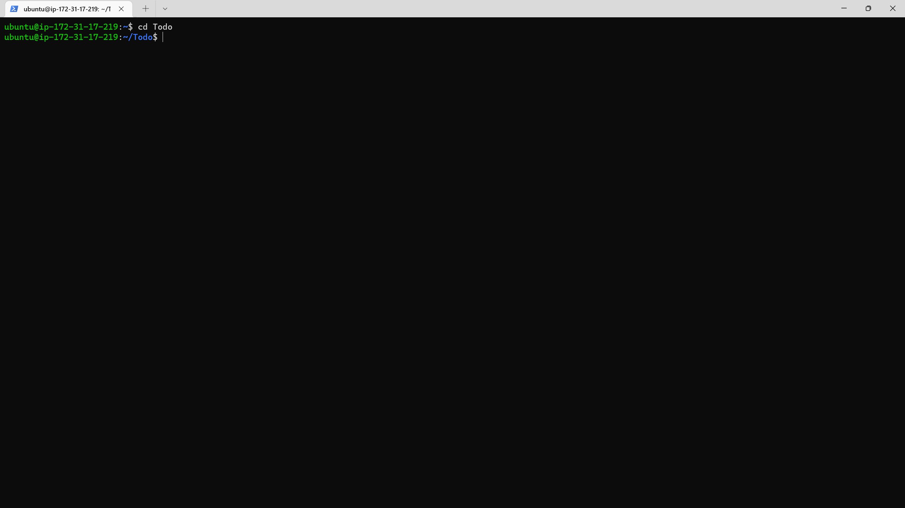

- Next, we will use the command npm init to initialise our project, so that a new file named package.json will be created. This file will normally contain information about our application and the dependencies that it needs to run. Follow the prompts after running the command. We would press Enter several times to accept default values, then accept to write out the package.json file by typing yes.

    ```
    npm init
    ```

    Results:
    

    Note: The command above initialises our project.


## Install ExpressJS
Now we would move on with installing express js.

- To use express, install it using npm.
    ```
    npm install express
    ```

    Results:
    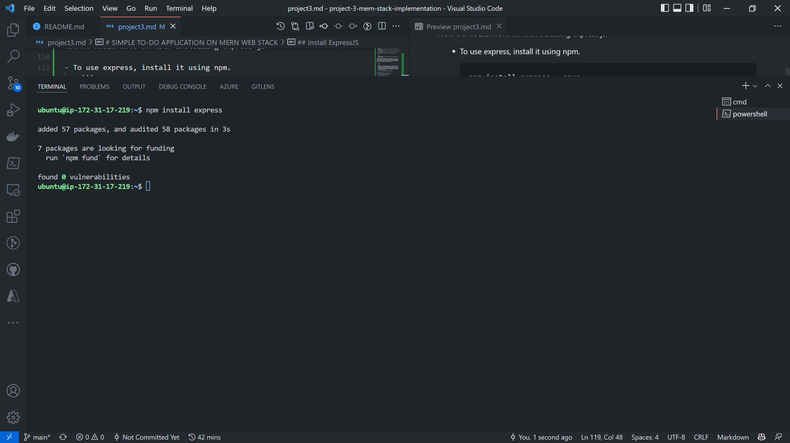

    Note: The command above installs expressjs.

- Now create a file index.js with the command below.
    ```
    touch index.js
    ```

    Results:
    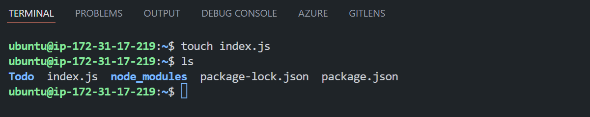

    Note: The command above creates a file index.js and run ls to confirm that your index.js file is successfully created

- Install the dotenv module
    ```
    npm install dotenv
    ```

    Results:
    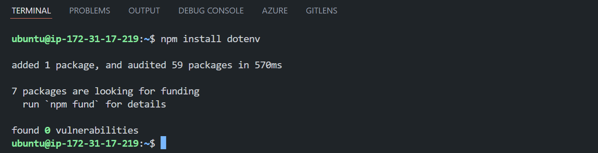

    Note: The command above installs the dotenv module.

- Open the index.js file with the command below.
    ```
    vim index.js
    ```
    and paste the following code:
    ```
    const express = require('express');
    require('dotenv').config();

    const app = express();

    const port = process.env.PORT || 8000;

    app.use((req, res, next) => {
    res.header("Access-Control-Allow-Origin", "\*");
    res.header("Access-Control-Allow-Headers", "Origin, X-Requested-With, Content-Type, Accept");
    next();
    });

    app.use((req, res, next) => {
    res.send('Welcome to Express');
    });

    app.listen(port, () => {
    console.log(`Server running on port ${port}`)
    });
    ```

    Results:
    

    Note: The command above opens the index.js file.

- Now it is time to start our server to see if it works. Open your terminal in the same directory as your index.js file and type the following command:
    ```
    node index.js
    ```

    Results:
    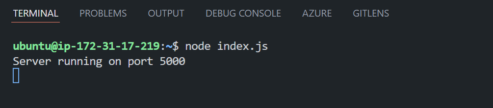

    Note: The command above starts our server.

- Open up your browser and try to access your server’s Public IP or Public DNS name followed by port 8000
    ```
    http://<ip-address>:8000
    ```

    Results:
    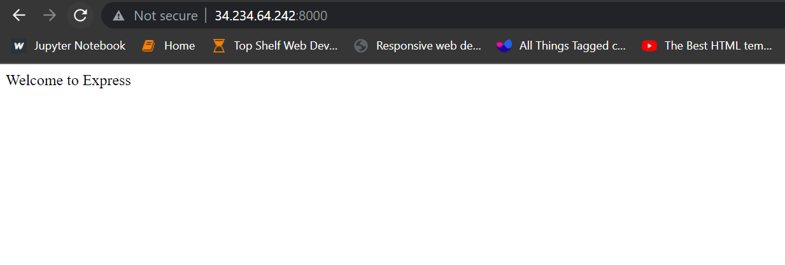

    Note: The command above opens up your browser and try to access your server’s Public IP or Public DNS name followed by port 8000.

### Routes
There are three actions that our To-Do application needs to be able to do:

Create a new task
Display list of all tasks
Delete a completed task
Each task will be associated with some particular endpoint and will use different standard HTTP request methods: POST, GET, DELETE.

- For each task, we need to create routes that will define various endpoints that the To-do app will depend on. 

    So let us create a folder routes and change directory to the routes folder
    ```
    mkdir routes
    cd routes
    ```

    Results:
    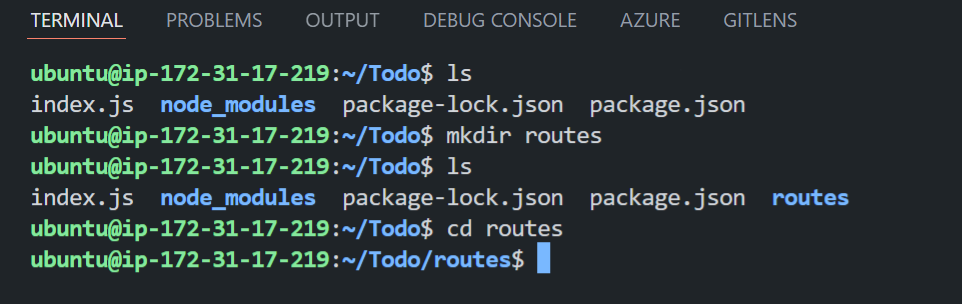

    Note: The command above creates a folder routes and helps us change directory into that created folder.

- Now, create a file api.js with the command below.
    ```
    touch api.js
    ```

    Results:
    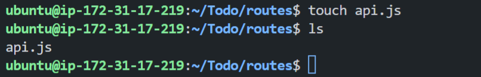

    Note: The command above creates a file api.js and run ls to confirm that your api.js file is successfully created

- Open the file with the command below
    ```
    nano api.js
    ```
    and paste the following code:
    ```
    const express = require ('express');
    const router = express.Router();

    router.get('/todos', (req, res, next) => {

    });

    router.post('/todos', (req, res, next) => {

    });

    router.delete('/todos/:id', (req, res, next) => {

    })

    module.exports = router;
    ```

    Results:
    

    Note: The command above opens the file api.js and allows us to enter the commands and create the get, delete and post endpoints.

## Models
Moving forward let's create Models directory.

